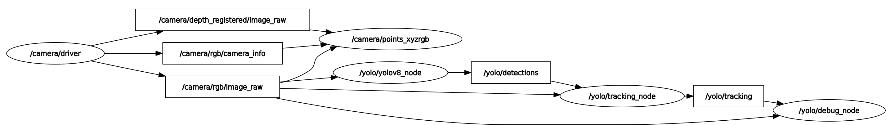
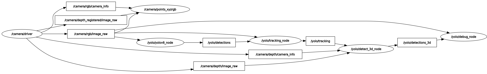

# yolo_ros

ROS 2 wrap for YOLO models from [Ultralytics](https://github.com/ultralytics/ultralytics) to perform object detection and tracking, instance segmentation, human pose estimation, Oriented Bounding Box (OBB) and image classification. There are also 3D versions of object detection, instance segmentation and human pose estimation based on depth images.

This is a fork of [`mgonzs13/yolo_ros`](https://github.com/mgonzs13/yolo_ros) in which the Python nodes have been replaced by a pure **C++ / ONNX Runtime** implementation (no Python runtime, no `ultralytics` dependency at run time), and the whole repository is licensed under **MIT**.

<div align="center">

[](https://opensource.org/license/mit) [](https://github.com/agonzc34/yolov8_ros/releases) [](https://github.com/agonzc34/yolov8_ros?branch=yolo_onnx_cpp) [](https://github.com/agonzc34/yolov8_ros/commits/yolo_onnx_cpp) [](https://github.com/agonzc34/yolov8_ros/issues) [](https://github.com/agonzc34/yolov8_ros/pulls) [](https://github.com/agonzc34/yolov8_ros/graphs/contributors) [](https://github.com/agonzc34/yolov8_ros/actions/workflows/doxygen-deployment.yml?branch=yolo_onnx_cpp)

| ROS 2 Distro |                          Branch                          |                                                                                                         Build status                                                                                                         |
| :----------: | :------------------------------------------------------: | :--------------------------------------------------------------------------------------------------------------------------------------------------------------------------------------------------------------------------: |
|  **Humble**  | [`yolo_onnx_cpp`](https://github.com/agonzc34/yolov8_ros/tree/yolo_onnx_cpp) |  [](https://github.com/agonzc34/yolov8_ros/actions/workflows/humble-docker-build.yml?branch=yolo_onnx_cpp)   |
|   **Iron**   | [`yolo_onnx_cpp`](https://github.com/agonzc34/yolov8_ros/tree/yolo_onnx_cpp) |     [](https://github.com/agonzc34/yolov8_ros/actions/workflows/iron-docker-build.yml?branch=yolo_onnx_cpp)      |
|  **Jazzy**   | [`yolo_onnx_cpp`](https://github.com/agonzc34/yolov8_ros/tree/yolo_onnx_cpp) |    [](https://github.com/agonzc34/yolov8_ros/actions/workflows/jazzy-docker-build.yml?branch=yolo_onnx_cpp)    |
|  **Kilted**  | [`yolo_onnx_cpp`](https://github.com/agonzc34/yolov8_ros/tree/yolo_onnx_cpp) |  [](https://github.com/agonzc34/yolov8_ros/actions/workflows/kilted-docker-build.yml?branch=yolo_onnx_cpp)   |
| **Lyrical**  | [`yolo_onnx_cpp`](https://github.com/agonzc34/yolov8_ros/tree/yolo_onnx_cpp) | [](https://github.com/agonzc34/yolov8_ros/actions/workflows/lyrical-docker-build.yml?branch=yolo_onnx_cpp) |
| **Rolling**  | [`yolo_onnx_cpp`](https://github.com/agonzc34/yolov8_ros/tree/yolo_onnx_cpp) | [](https://github.com/agonzc34/yolov8_ros/actions/workflows/rolling-docker-build.yml?branch=yolo_onnx_cpp) |

</div>

## Table of Contents

1. [Installation](#installation)
2. [Docker](#docker)
3. [Models](#models)
4. [Usage](#usage)
5. [Topics](#topics)
6. [Services](#services)
7. [Parameters](#parameters)
8. [Lifecycle Nodes](#lifecycle-nodes)
9. [Demos](#demos)
10. [Documentation](#documentation)
11. [License](#license)

## Installation

### Prerequisites

- Ubuntu 22.04 with ROS 2 Humble (the workspace is sourced as an overlay over `/opt/ros/humble`).
- A CUDA toolchain for GPU builds, plus cuDNN 9 on the host:
  `sudo apt install libcudnn9-cuda-12`.
- libcurl / OpenSSL headers if you use the Hugging Face Hub model download:
  `sudo apt install libcurl4-openssl-dev libssl-dev`.
- An exported ONNX model. Models live outside the repository — pass
  `model:=<path>` to every launch, since the launch defaults are
  machine-specific. See [Models](#models).

### Build

Clone the repository into your ROS 2 workspace and build it. ONNX Runtime
1.20.0 is downloaded automatically by `yolo_onnxruntime_vendor` at configure
time (CPU or, with `-DONNX_GPU=ON`, the GPU tarball), so there is no runtime
dependency to install for inference.

```shell
# Clone this repo
cd ~/ros2_ws/src
git clone https://github.com/agonzc34/yolov8_ros.git

# Install rosdep dependencies
cd ~/ros2_ws
rosdep install --from-paths src --ignore-src -r -y

# GPU build (what this branch is developed with)
colcon build --symlink-install --cmake-args -DONNX_GPU=ON
source install/setup.bash
```

For a CPU-only build, omit `-DONNX_GPU=ON`; `yolo_onnxruntime_vendor` then
fetches the CPU ONNX Runtime. For a fast C++-only loop, rebuild just the
package (select `yolo_msgs` first if the messages changed — it must build
before `yolo_ros`):

```shell
colcon build --symlink-install --cmake-args -DONNX_GPU=ON --packages-select yolo_msgs
colcon build --symlink-install --cmake-args -DONNX_GPU=ON --packages-select yolo_ros
```

Launch from the workspace root so relative source paths resolve.

### Testing

There is currently no C++ test suite: `ament_lint_auto` is declared but no
tests are registered. The Python package and its ament lint were removed along
with the rest of the Python implementation.

## Docker

Build the yolo_ros docker image. Note that the bundled `Dockerfile` performs a
CPU build (plain `colcon build`, no `-DONNX_GPU=ON`); derive from it and add
`-DONNX_GPU=ON` yourself for a GPU image.

```shell
docker build -t yolo_ros .
```

Run the container. If you want to use CUDA, install the
[NVIDIA Container Toolkit](https://docs.nvidia.com/datacenter/cloud-native/container-toolkit/latest/install-guide.html)
and add `--gpus all` (and use a GPU-enabled image).

```shell
docker run -it --rm --gpus all yolo_ros
```

## Models

The C++ pipeline runs any Ultralytics-exported **ONNX** model. The compatible
model families are:

- [YOLOv8](https://docs.ultralytics.com/models/yolov8/)
- [YOLOv9](https://docs.ultralytics.com/models/yolov9/)
- [YOLOv10](https://docs.ultralytics.com/models/yolov10/)
- [YOLOv11](https://docs.ultralytics.com/models/yolo11/)
- [YOLOv12](https://docs.ultralytics.com/models/yolo12/)
- [YOLOv26](https://docs.ultralytics.com/models/yolo26/)

Each family can be exported for **detection** (`detect`), **instance
segmentation** (`segment`), **human pose** (`pose`), **oriented bounding box**
(`obb`) and **image classification** (`classify`). Export a `.pt` checkpoint to
ONNX with the `ultralytics` package — either with `uv` (no environment needed)
or a plain `pip install`:

```shell
# uv one-liner (fetches ultralytics + ONNX deps on the fly)
uv run --with ultralytics --with onnx --with onnxruntime --with onnxslim \
  yolo export model=yolo26m.pt format=onnx imgsz=640 opset=12

# classic: pip install ultralytics, then
yolo export model=yolo26m.pt format=onnx imgsz=640 opset=12
```

Notes:

- The exported `.onnx` is self-contained: Ultralytics writes the class
  vocabulary into the ONNX graph metadata (`names` key), which
  `Model::load_class_names()` reads at startup. The `coco.names` fallback is
  only used when a model has no metadata.
- Keep the exported file outside the repository and pass `model:=<path>` on
  every launch.
- `model_type` selects the pipeline (`YOLO`/`Detect`, `Segment`, `Pose`, `OBB`,
  `Classify`, case-insensitive). `auto` (the default) falls back to a filename
  heuristic: a path containing `segment` selects segmentation, `pose` selects
  pose, `obb` selects OBB, `cls`/`classify` selects classification, otherwise
  detection. Ultralytics names segmentation exports `*-seg.onnx` (not
  `-segment`), so the segment config sets `model_type: Segment` explicitly.
- The input size is fixed by the ONNX tensor (logged at startup), so the
  Python-only knobs `imgsz_height` / `imgsz_width` and
  `half` / `augment` / `agnostic_nms` / `retina_masks` were removed from the
  C++ node and its configs: NMS is baked at export and the pipeline runs FP32
  with no test-time augmentation.
- OBB models have no baked-NMS export (rotated NMS cannot be exported into the
  graph), so the C++ postprocessor performs its own per-class rotated NMS and
  `iou` re-tunes it. The rotation angle is published in
  `BoundingBox2D.center.theta` (radians) with `size` holding the rotated `w`/`h`.
- Classification exports bake the softmax into the graph (`output0` is `[1, N]`
  probabilities), so the postprocessor does **not** re-apply it. Top-`top_k`
  classes are published as detections with an **empty** bbox (image-level
  labels have no spatial extent).

### Download a model from the Hugging Face Hub

Instead of a local path, the node can fetch the model from the Hub at startup
via the `yolo_hfhub_vendor` package. Set `model_repo` + `model_filename` in the
matching `config/yolo*.yaml` section (or on the command line); the `model` path
is then ignored. The file is cached under `~/.cache/huggingface/hub` by default
(override with the optional `cache_dir` param) and reused unless
`force_download: true`:

```yaml
/yolo/yolo_node:
  ros__parameters:
    model_repo: agonzc34/yolo26m # HF repo id
    model_filename: yolo26m.onnx # file inside that repo
    force_download: false
```

Or on the command line: `ros2 launch yolo_bringup yolo.launch.py
model_repo:=agonzc34/yolo26m model_filename:=yolo26m.onnx`. Requires the libcurl
dev headers listed above; only used when `model_repo`/`model_filename` are set.
The node logs the model source as `[huggingface]` (with repo/filename) or
`[local]` (with the path) so the two are easy to tell apart.

> **License note**: Ultralytics models and pretrained weights are **not** MIT
> licensed. They are released under the **AGPL-3.0** license (with commercial /
> enterprise licensing available from Ultralytics), so the MIT license of this
> repository does **not** cover them. Check the terms of the specific model you
> use at <https://ultralytics.com/license> — especially if you ship or deploy
> the model.

## Usage

Run from the workspace root (so the workspace is sourced as an overlay). Each
pipeline has its own launch file and namespace; the launch passes its
`config/yolo*.yaml` file verbatim to the nodes and makes no topic remaps.

### Object Detection

Standard detection, with tracking enabled by default (namespace `yolo`):

```shell
ros2 launch yolo_bringup yolo.launch.py
```

### Instance Segmentation

Namespace `yolo_seg`; `model_type: Segment` is forced in `config/yolo_segment.yaml`:

```shell
ros2 launch yolo_bringup yolo_segment.launch.py
```

### Human Pose

Namespace `yolo_pose`; `model_type: Pose` is forced in `config/yolo_pose.yaml`:

```shell
ros2 launch yolo_bringup yolo_pose.launch.py
```

### Oriented Bounding Box (OBB)

Namespace `yolo_obb`; `model_type: OBB` is forced in `config/yolo_obb.yaml`. This
launch also starts the tracking and debug nodes:

```shell
ros2 launch yolo_bringup yolo_obb.launch.py
```

### Image Classification

Namespace `yolo_cls`; `model_type: Classify` is forced in
`config/yolo_classify.yaml`. The default model is downloaded from the Hugging
Face Hub at configure time. No tracking/3D/debug nodes are started:

```shell
ros2 launch yolo_bringup yolo_classify.launch.py
```

<p align="center">
  
</p>

### 3D Detection

Add `use_3d:=True` to the detection, segmentation, pose or OBB launch to also
start the C++ 3D detection node, which subscribes to the depth image +
`CameraInfo` and publishes `detections_3d`:

```shell
ros2 launch yolo_bringup yolo.launch.py use_3d:=True
```

For segmentation the depth ROI is driven by the mask polygon; for pose the 2D
keypoints are back-projected to 3D (`debug_kp_markers`). The 3D node can also
estimate the orientation of each box (an oriented bounding box fit by PCA to a
strided depth sample) when `enable_orientation` is set. When enabled,
`detections_3d` carries a non-identity quaternion in each box's
`center.orientation` and the box `size` is expressed along the object's own
axes.

## Topics

All topics are published under the launch namespace (default `yolo`):

- **detections**: Objects detected by YOLO using the RGB images. Each object
  contains a bounding box and a class name, plus a mask or a list of keypoints
  for segmentation/pose models.
- **tracking**: Objects detected and tracked by ByteTrack. Each object is
  assigned a stable tracking ID.
- **detections_3d**: 3D objects detected (with `use_3d:=True`). YOLO results
  are used to crop the depth image and create 3D bounding boxes and keypoints.
- **debug_image**: Debug image showing the detected and tracked objects. It can
  be visualized with `rqt_image_view` or `rviz2`.
- **debug_bb_markers** / **debug_kp_markers**: RViz `MarkerArray`s driven by the
  3D box / keypoint stream (e.g. when the debug node reads `detections_3d`).

## Services

- **/yolo/enable**: Service to enable or disable the detection node at runtime.
  Accepts a boolean value (`std_srvs/SetBool`).

## Parameters

Configuration is entirely file-driven: the C++ launches pass
`parameters=[params_file]` and make no topic remaps and no inline parameter
dictionaries. Sections are keyed by the node's fully qualified name, so the key
must include the launch namespace (default `yolo`):

```yaml
/yolo/yolo_node:
  ros__parameters:
    model_type: auto
```

If you change `namespace:=`, update the matching config block names. The key
parameters are listed below; see `yolo_bringup/config/yolo*.yaml` for the
complete, annotated set.

### Inference node (`yolo_node`)

- **model_type**: Pipeline to run: `YOLO`/`Detect`, `Segment`, `Pose`, `OBB`,
  `Classify` or `auto` (default: `auto`).
- **model**: Path to the ONNX model (default: machine-specific).
- **model_repo** / **model_filename** / **force_download** / **cache_dir**:
  Optional Hugging Face Hub download (used instead of `model` when set).
- **device**: Execution device, e.g. `cuda:0` or `cpu` (default: `cuda:0`).
- **threshold**: Detection confidence threshold (default: `0.7`).
- **iou**: IoU threshold for NMS. Re-tunes the C++ NMS for raw-output exports
  (segment/pose/OBB) and has no effect on baked-NMS models (default: `0.45`).
- **max_det**: Maximum number of detections per image (default: `300`).
- **enable**: Whether to start with inference enabled (default: `true`).
- **image_topic**: Input RGB image topic (default: machine-specific).
- **image_reliability**: QoS for the image topic: `0`=system default,
  `1`=Reliable, `2`=Best Effort (default: `2`).
- **n_threads**: CPU execution-provider threads; `-1` = auto (default: `-1`).
- **max_fps**: Cap the inference/publish rate in Hz; `0` = unlimited (default: `0`).
- **top_k**: Classification only — number of top classes to publish (default: `5`).

### Tracking node (`tracking_node`)

- **tracker_type**: Tracker implementation key (default: `bytetrack`).
- **image_topic** / **image_reliability**: Tracker image input and QoS.
- **track_high_thresh**: First-stage association threshold (default: `0.25`).
- **track_low_thresh**: Second-stage threshold for low-score matches (default: `0.1`).
- **new_track_thresh**: Score above which a new track is started (default: `0.25`).
- **track_buffer**: Frames a lost track is kept alive (default: `30`).
- **match_thresh**: Association similarity threshold (IoU/cost) (default: `0.8`).
- **fuse_score**: Fuse detection score with IoU cost for matching (default: `true`).

### 3D detection node (`detect_3d_node`)

- **target_frame**: Frame to transform the 3D boxes into (default: `base_link`).
- **depth_image_units_divisor**: Divisor to convert the depth image to meters
  (default: `1000`).
- **depth_image_topic** / **depth_info_topic** / **depth_image_reliability** /
  **depth_info_reliability**: Depth input, its `CameraInfo` and their QoS.
- **detections_topic**: 2D stream to lift — `tracking` or `detections`.
- **enable_orientation**: Estimate and publish the 3D box orientation (default: `false`).
- **min_seg_points_for_orientation**: Minimum valid depth points required per
  detection for orientation estimation (default: `20`).

### Debug node (`debug_node`)

- **image_topic** / **image_reliability**: Image input and QoS.
- **detections_topic**: 2D stream to draw — `tracking`, `detections` or
  `detections_3d` (default: `tracking`).
- **markers_topic**: 3D stream used to drive the RViz markers (default:
  `detections_3d`).

## Lifecycle Nodes

Every node is a lifecycle node. The executables call `configure()` and
`activate()` themselves in `main()`, so the nodes go active as soon as they are
launched. In the unconfigured and inactive states the node does no work: the
ONNX model is loaded and the image subscriber is created only on activation,
and both are torn down again on deactivation, keeping the idle CPU/VRAM
footprint low.

<p align="center">
  
</p>

## Demos

> The detection, segmentation, pose and 3D demos below are reused from the
> [upstream project](https://github.com/mgonzs13/yolo_ros). The OBB and
> classification demos are not yet recorded — drop the recordings at the listed
> paths to have them show up here.

### Object Detection

Standard behavior including ByteTrack object tracking.

```shell
ros2 launch yolo_bringup yolo.launch.py
```

[](https://drive.google.com/file/d/1gTQt6soSIq1g2QmK7locHDiZ-8MqVl2w/view?usp=sharing)

### Instance Segmentation

Instance masks are the borders of the detected objects, not all the pixels
inside the masks.

```shell
ros2 launch yolo_bringup yolo_segment.launch.py
```

[](https://drive.google.com/file/d/1dwArjDLSNkuOGIB0nSzZR6ABIOCJhAFq/view?usp=sharing)

### Human Pose

Visible persons are detected along with their skeleton keypoints.

```shell
ros2 launch yolo_bringup yolo_pose.launch.py
```

[](https://drive.google.com/file/d/1pRy9lLSXiFEVFpcbesMCzmTMEoUXGWgr/view?usp=sharing)

### Oriented Bounding Box

Rotated boxes are estimated for oriented objects.

```shell
ros2 launch yolo_bringup yolo_obb.launch.py
```

<p align="center">
  
</p>

### Image Classification

Image-level ImageNet-1k labels are published as detections with an empty bbox.

```shell
ros2 launch yolo_bringup yolo_classify.launch.py
```

<p align="center">
  
</p>

### 3D Object Detection

The 3D bounding boxes are calculated by filtering the depth image data from an
RGB-D camera using the 2D bounding box.

```shell
ros2 launch yolo_bringup yolo.launch.py use_3d:=True
```

[](https://drive.google.com/file/d/1ZcN_u9RB9_JKq37mdtpzXx3b44tlU-pr/view?usp=sharing)

## Documentation

The C++ API reference is generated with Doxygen and published to GitHub Pages
on every release:

- Latest: <https://agonzc34.github.io/yolov8_ros/>

Build it locally (Doxygen + Graphviz):

```shell
sudo apt install doxygen graphviz
doxygen .github/Doxyfile
# output: docs/index.html
```

## License

The whole repository is licensed under the **MIT License**. See the root
[`LICENSE`](./LICENSE) file; it applies across the repository where a package
does not provide a more specific license file.

Specifically, the repository contains independently licensed ROS 2 packages:

- `yolo_ros`, `yolo_msgs`, `yolo_bringup` and `yolo_onnxruntime_vendor` are
  licensed under **MIT**. See each package's `LICENSE` file; third-party notices
  are installed with the applicable packages (`yolo_ros/THIRD_PARTY_NOTICES.md`).

The C++ pipeline adapts behavior from the original `yolo_ros` Python nodes;
those contributions were authorized by their copyright holder for release in the
MIT-licensed C++ pipeline (see `THIRD_PARTY_NOTICES.md`).

Model weights and exported ONNX files are separate artifacts and remain subject
to their respective licenses; the MIT license for the C++ pipeline does not
relicense them. In particular, Ultralytics models are AGPL-3.0 — see the
[Models](#models) section above.
